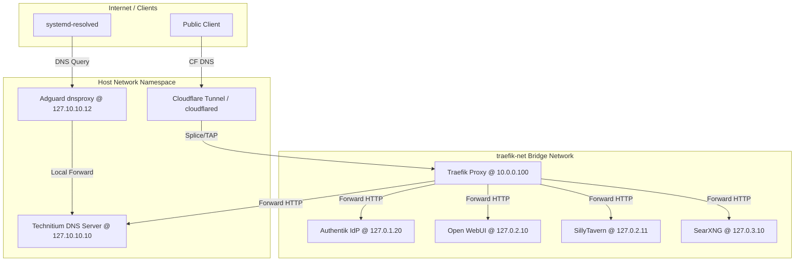

# rusano-lab — Podman Rootless Quadlet Cloudlab

This repository contains the configuration, architecture, and deployment specs for a secure, rootless GitOps cloudlab (homelab in the cloud). The stack is built using **Podman 6.0 Rootless Quadlets** on Fedora 41, replacing traditional Docker Compose deployments.

---

## Architecture Overview

The lab is split into three main access tiers:
1. **Public Web Services**: Exposed via Cloudflare DNS and Cloudflare Tunnel (`cloudflared`) to [Traefik (ACME-only)](file:///home/rusano/Projects/Code/rusano/rusano-lab/app/network/traefik/traefik.container), routing traffic to internal services.
2. **Private DNS (Local Resolver)**: Local systemd-resolved queries forwarded via [Adguard dnsproxy](file:///home/rusano/Projects/Code/rusano/rusano-lab/app/network/dnsproxy/dnsproxy.container) to the [Technitium DNS Server](file:///home/rusano/Projects/Code/rusano/rusano-lab/app/network/technitium/technitium-server.container) on loopback IPs.
3. **VPN & Admin Services**: Sensitive settings, settings/consoles, and dashboards that are accessible only via the Tailscale VPN network.

### System Topology



---

## Core Security Tenets

All services in this lab strictly adhere to the following rules from [AGENTS.md](file:///home/rusano/Projects/Code/rusano/rusano-lab/AGENTS.md):
- **Rootless & Unprivileged**: No container runs as root. The Podman daemon runs in the user space of an unprivileged host user.
- **Strict Capabilities Drop**: All containers deploy with `DropCapability=ALL`. Only essential capabilities (like `NET_BIND_SERVICE` or `NET_RAW`) are added back.
- **ReadOnly Filesystems**: Containers run with `ReadOnly=true`. Dynamic writes are strictly limited to explicit `Tmpfs` and named volumes.
- **Dedicated Loopback IPs**: No service binds to `0.0.0.0` or `127.0.0.1`. Every service gets a designated loopback IP, routing via `pasta` mode to preserve client source IPs.
- **Zero Database Coupling**: No monolithic or shared databases. PostgreSQL and Valkey/Redis instances run alongside their parent services in isolated pods.

---

## The IP Matrix

This matrix acts as the single source of truth for all network ports and host interfaces.

| Service / Pod | Host IP | Target Ports | Zone / Purpose | Configuration |
| :--- | :--- | :--- | :--- | :--- |
| **Traefik Proxy** | `10.0.0.100` | `:80`, `:443` | Host-Routed Proxy | [traefik.container](file:///home/rusano/Projects/Code/rusano/rusano-lab/app/network/traefik/traefik.container) |
| **Technitium DNS** | `127.10.10.10` | `:53`, `:5380`, `:53443` | Private DNS Server | [technitium-server.container](file:///home/rusano/Projects/Code/rusano/rusano-lab/app/network/technitium/technitium-server.container) |
| **Adguard dnsproxy**| `127.10.10.12` | `:53`          | Local DNS Forwarder       | [dnsproxy.container](file:///home/rusano/Projects/Code/rusano/rusano-lab/app/network/dnsproxy/dnsproxy.container) |
| **Authentik SSO** | `127.0.1.20` | `:9000`, `:9443` | Identity Management | [authentik-server.container](file:///home/rusano/Projects/Code/rusano/rusano-lab/app/auth/authentik/authentik-server.container) |
| **Open WebUI** | `127.0.2.10` | `:8080` | AI Chat Client | [openwebui.container](file:///home/rusano/Projects/Code/rusano/rusano-lab/app/ai/openwebui/openwebui.container) |
| **SillyTavern** | `127.0.2.11` | `:8000` | AI Roleplay Client | [sillytavern.container](file:///home/rusano/Projects/Code/rusano/rusano-lab/app/ai/sillytavern/sillytavern.container) |
| **SearXNG Search** | `127.0.3.10` | `:8080` | Private Search Engine | [searxng.container](file:///home/rusano/Projects/Code/rusano/rusano-lab/app/privacy/searxng/searxng.container) |
| **SearXNG Valkey** | `127.0.3.11` | `:6379` | Search Cache Sidecar | [searxng-valkey.container](file:///home/rusano/Projects/Code/rusano/rusano-lab/app/privacy/searxng/searxng-valkey.container) |

---

## Directory Structure

```plain
rusano-lab/
├── app/
│   ├── ai/
│   │   ├── openwebui/               # Open WebUI pod and container specs
│   │   └── sillytavern/             # SillyTavern pod and container specs
│   ├── auth/
│   │   └── authentik/               # Authentik multi-service pod configuration
│   ├── database/
│   │   ├── adminer/                 # Database admin UI (Compose format)
│   │   └── postgres/                # Postgres instance (Compose format)
│   ├── network/
│   │   ├── cloudflared/             # Cloudflare Tunnel config
│   │   ├── dnsproxy/                # dnsproxy local DNS forwarder
│   │   ├── technitium/              # Technitium recursive DNS configurations
│   │   ├── traefik/                 # Traefik router configuration files
│   │   └── traefik.network          # Shared network definition
│   └── privacy/
│       └── searxng/                 # SearXNG metasearch configurations
├── AGENTS.md                        # Coding and repository rulebook
├── DEPLOYMENT.md                    # Installation and startup guides
└── DEVELOPMENT.md                   # Workspace architecture guidelines
```

---

## Next Steps

- Proceed to [DEPLOYMENT.md](file:///home/rusano/Projects/Code/rusano/rusano-lab/DEPLOYMENT.md) to set up and run the lab.
- Reference [DEVELOPMENT.md](file:///home/rusano/Projects/Code/rusano/rusano-lab/DEVELOPMENT.md) for design and code modification practices.
